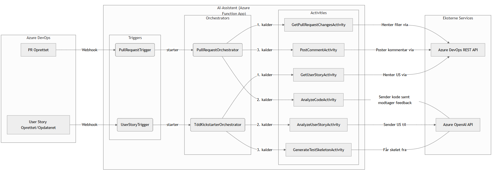
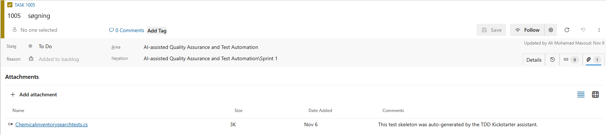
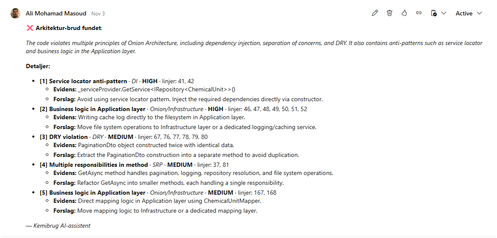

# AI-assisted Quality Assurance and Test Automation in Azure DevOps

> **Final Diploma Project for B.Eng. in IT & Economics at the Technical University of Denmark (DTU).**
> **Final Grade: 12/12 (Top Grade).**

This project is a functional prototype of an AI assistant designed to be deeply integrated into the Azure DevOps environment. Its purpose is to automate key quality assurance steps, lower the barrier for Test-Driven Development (TDD) adoption, and improve the overall developer workflow for the "Kemibrug" platform.

## 🎯 Problem Statement

In modern software development, balancing rapid delivery with high code quality is a constant challenge. For the development team behind the "Kemibrug" platform, manual processes like code reviews and the initial effort of writing test code for TDD had become significant bottlenecks. An analysis revealed a high rate of self-approved Pull Requests (68.7%), posing a risk of technical debt and confirmation bias.

This project aims to solve these issues by introducing an intelligent AI assistant that automates the repetitive, cognitive "grunt work" of initial quality assurance, freeing up developer resources for more complex tasks.

## ✨ Key Features

The solution is divided into two main phases, each targeting a specific part of the developer workflow:

### Phase A: TDD Kickstarter
This feature is designed to eliminate the initial friction of adopting Test-Driven Development.
- **Automated Test Skeleton Generation:** Triggered by a webhook when a User Story is created or updated in Azure DevOps.
- **AI-Powered Analysis:** An AI agent analyzes the User Story's title, description, and acceptance criteria.
- **C# xUnit File Creation:** Generates a compilable C# test skeleton file with a class, `[Fact]` methods for each acceptance criterion, and meaningful method names, directly following the Arrange-Act-Assert pattern.
- **Direct Feedback Loop:** The generated test file is automatically uploaded as an attachment to the User Story in Azure DevOps, ready for the developer to use.

### Phase B: Automated PR Analysis
This feature provides an automated "first-pass" code review on Pull Requests to catch common architectural violations.
- **Automated Code Review:** Triggered by a webhook when a Pull Request is created in Azure DevOps.
- **Architectural Validation with RAG:** An AI agent uses **Retrieval-Augmented Generation (RAG)** to validate the changed code against a specific, predefined set of architectural rules (e.g., enforcing Onion Architecture principles).
- **Actionable Feedback:** The assistant posts a structured, neutral, and actionable comment directly on the Pull Request, highlighting any violations and suggesting improvements. This reduces the manual review burden and ensures consistent quality.

## 🛠️ Tech Stack & Architecture

The solution is built on a modern, serverless, and event-driven architecture, primarily utilizing the Microsoft Azure ecosystem.

- **Backend:** C#, .NET 8, Azure Functions (Durable Functions for orchestration)
- **AI & Machine Learning:** Azure OpenAI (GPT-4 models), Retrieval-Augmented Generation (RAG), Advanced Prompt Engineering
- **DevOps & Cloud:** Azure DevOps (Webhooks, REST API), GitHub Actions (for CI/CD), Azure
- **Architecture Principles:** The assistant is designed to enforce rules based on **Onion Architecture**, SOLID, and DRY principles.

### System Architecture Diagram
*(This diagram illustrates the data flow from Azure DevOps events through the AI assistant's functions and back to the external services.)*

## 🚀 Demo & Screenshots

### TDD Kickstarter in Action
*A generated C# xUnit test skeleton attached directly to the User Story in Azure DevOps.*

### Automated PR Analysis in Action
*An automated comment posted by the AI assistant on a Pull Request, identifying architectural violations.*

## 🙏 Acknowledgments

A special thanks to my supervisor, **Lars Sommer**, and the entire **DTU ITAM** and **Kemibrug** teams for their invaluable guidance, feedback, and for providing the real-world context that made this project possible.
